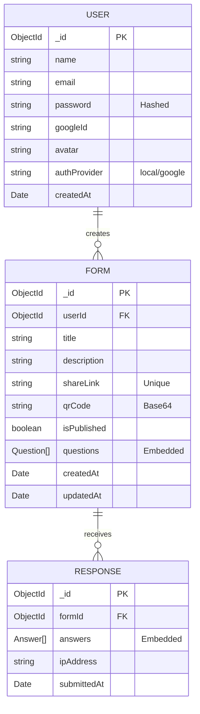

# Project Requirements & Documentation: Smart Form Builder

> **Note**: This document is formatted in Markdown. To convert this to PDF:
> 1. Open this file in VS Code.
> 2. Open the Command Palette (`Ctrl+Shift+P` / `Cmd+Shift+P`).
> 3. Type "Markdown PDF: Export (pdf)" if you have the extension installed, or use a "Print" function from the preview.

---

## 1. Tech Stack & Architecture

### Justification of Selected Technology Stack: MERN

 This project utilizes the **MERN (MongoDB, Express.js, React, Node.js)** stack, enhanced with **Next.js** for the frontend.

*   **MongoDB (Database)**: Selected for its flexibility with document-based data. Form structures are often dynamic (variable questions, types, and options), which maps perfectly to a NoSQL JSON-like structure (BSON) rather than rigid SQL tables.
*   **Express.js (Backend Framework)**: A minimal and flexible Node.js web application framework that provides a robust set of features for web and mobile applications, specifically for building the RESTful API endpoints.
*   **Next.js (React Framework)**: Used for the frontend to provide Server-Side Rendering (SSR) and Static Site Generation (SSG) capabilities, improving performance and SEO. It simplifies routing and provides a robust structure for React applications.
*   **Node.js (Runtime)**: Allows sharing the same language (JavaScript/TypeScript) across client and server, unifying the development ecosystem.

### System Flow Diagram

The following diagram illustrates the interaction between the Client (Next.js), Server (Express API), and Database.

```mermaid
graph TD
    User[End User]
    Browser[Client Browser (Next.js)]
    API[Backend API (Express.js)]
    DB[(MongoDB)]
    Auth[Google OAuth / JWT]

    User -->|Interacts| Browser
    Browser -->|HTTP Requests (Axios)| API
    API -->|Auth Check| Auth
    API -->|Query/Update| DB
    DB -->|Data| API
    API -->|JSON Response| Browser
    Browser -->|Update UI| User
```

---

## 2. DB Schema & Entity Design

### ER Diagram



### Entity Details

1.  **User**: Manages authentication and identity. Supports both local email/password (hashed) and Google OAuth.
2.  **Form**: The core entity. Contains metadata (title, status) and an embedded array of `questions`.
    *   **Questions Array**: Stores the definition of form fields (`type`, `label`, `required`, `options`, `validation`).
3.  **Response**: Captures a submission for a specific form.
    *   **Answers Array**: Stores the user's input paired with the `questionId`.

---

## 3. UI/UX Wireframes & Theme

### Color Palette & Theme

The application uses a **Modern, Clean** aesthetic with a focus on usability and accessibility.

*   **Primary Gradient**: `from-blue-600` to `purple-600` (Used for primary buttons, hero text, and accents).
*   **Background**: `min-h-screen bg-gradient-to-br from-blue-50 via-white to-purple-50`.
*   **Component Library**: **HeroUI (NextUI)** is used for polished, accessible components (Inputs, Buttons, Cards, Modals).
*   **Dark Mode**: Supported via Tailwind's `dark` variant and Next-Themes.

### Wireframes (Conceptual)

**1. Dashboard Layout**
```
+-------------------------------------------------------+
|  [Logo]       [Dashboard] [Forms]        [User Avatar]|  <-- Navbar
+-------------------------------------------------------+
|  [ + Create New Form ]                                |
|                                                       |
|  YOUR FORMS                                           |
|  +----------------+  +----------------+  +-----------+|
|  | Form Title     |  | Form Title     |  | ...       ||
|  | x Responses    |  | x Responses    |  |           ||
|  | [Edit][Share]  |  | [Edit][Share]  |  |           ||
|  +----------------+  +----------------+  +-----------+|
+-------------------------------------------------------+
```

**2. Form Builder Interface**
```
+-------------------------------------------------------+
|  < Back   [Untitled Form]          [Preview] [Publish]|
+-------------------------------------------------------+
|  [ T ] Text Input                                     |
|  [ # ] Number                                         |
|  [ @ ] Email          +---------------------------+   |
|  [ O ] Radio          |  Question 1               |   |
|                       |  Label: [ Enter Name ]    |   |
|                       |  Type: [ Text Input ]     |   |
|                       |  [x] Required             |   |
|                       +---------------------------+   |
|                       |  + Add Question           |   |
|                       +---------------------------+   |
+-------------------------------------------------------+
```

---

## 4. Project Boilerplate Setup

### Folder Structure

```
project-root/
├── backend/                 # Express API
│   ├── src/
│   │   ├── config/          # DB & Passport config
│   │   ├── middleware/      # Auth & Error handling
│   │   ├── models/          # Mongoose Schemas
│   │   ├── routes/          # API Endpoints
│   │   └── services/        # Business Logic
│   ├── .env                 # Secrets (PORT, MONGO_URI)
│   ├── server.js            # Entry point
│   └── package.json
│
└── client/                  # Next.js Frontend
    ├── app/                 # App Router Pages
    ├── components/          # Reusable UI components
    ├── config/              # Site config & Fonts
    ├── lib/                 # Utilities
    ├── styles/              # Global CSS & Tailwind
    ├── tailwind.config.ts   # Theme Config
    └── package.json
```

### GitHub Repository Initialization

1.  **Initialize Git**: `git init` in the root.
2.  **Create `.gitignore`**:
    ```gitignore
    node_modules/
    .env
    .env.local
    dist/
    build/
    .DS_Store
    ```
3.  **Environment Variables**:
    *   **Backend**: `PORT`, `MONGO_URI`, `JWT_SECRET`, `GOOGLE_CLIENT_ID`, `GOOGLE_CLIENT_SECRET`, `FRONTEND_URL`.
    *   **Client**: `NEXT_PUBLIC_API_URL`.

---

## 5. GitHub Workflow & Documentation

### Branching Strategy

We follow a simplified **Gitflow** strategy:

1.  **`main`**: Production-ready code. Deployable state.
2.  **`develop`** (Optional): Staging branch for integration testing.
3.  **Feature Branches**: `feature/feature-name` (e.g., `feature/auth-login`, `feature/form-builder`).
    *   Created from `main`.
    *   Merged back via **Pull Request (PR)**.

### README Structure

A standard `README.md` should include:

1.  **Project Title & Description**: What the app does.
2.  **Installation Steps**:
    ```bash
    # Backend
    cd backend
    npm install
    npm start

    # Frontend
    cd client
    npm install
    npm run dev
    ```
3.  **Features List**: AI generation, QR codes, Data export, etc.
4.  **Tech Stack Badges**: Visual indicators of technologies used.
